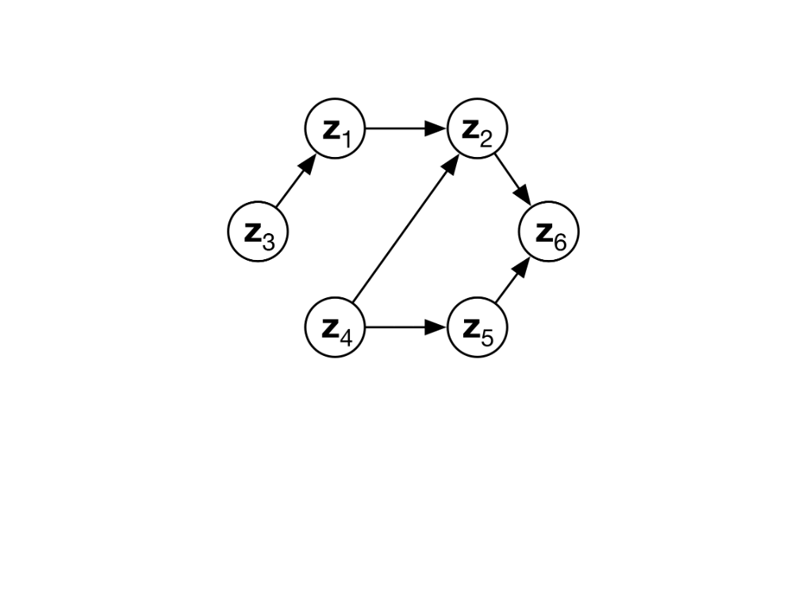

# Multi-View Causal Representation Learning with Partial Observability

[OpenReview](https://openreview.net/forum?id=OGtnhKQJms&noteId=MfmxoBwKjq) |
[arXiv](https://arxiv.org/abs/2311.04056) |
[BibTeX](#bibtex)

<p align="center">
    
</p>

Official code for the ICLR 2024 paper (**spotlight** - top5%) [Multi-View Causal Representation Learning with Partial Observability](https://openreview.net/forum?id=OGtnhKQJms&noteId=MfmxoBwKjq). This work was performed by
[Dingling Yao](https://ddcoan.github.io),
[Danru Xu](https://danruxu.wordpress.com/danru-xu/),
[Sébastien Lachapell](https://slachapelle.github.io),
[Sara Magliacane](https://saramagliacane.github.io),
[Perouz Taslakian](https://perouz.github.io),
[Georg Martius](https://is.mpg.de/person/gmartius),
[Julius von Kügelgen](https://sites.google.com/view/julius-von-kuegelgen)
and
[Francesco Locatello](https://www.francescolocatello.com/).
Please [cite us](#bibtex) when making use of our code or ideas.

## Installation
<p align="left">
    <a href="https://www.python.org/downloads/"></a>
    <a href="https://pytorch.org/get-started/"></a>
    <a href="https://black.readthedocs.io/en/stable/"></a>
    <a href="https://mamba.readthedocs.io/en/latest/"></a>
</p>

```shell
cd $PROJECT_DIR
mamba env create -f env.yaml
mamba activate crl_venv
pre-commit install
```

## Numerical Experiment
```shell
# train
python main_numerical.py

# evaluate
python main_numerical.py --evaluate
```


## Multimodal Experiment

Download the dataset [Multimodal3DIdent](https://zenodo.org/records/7678231) [Daunhawer et al. ICLR 2023]:
```shell
# download and extract the dataset
$ wget https://zenodo.org/record/7678231/files/m3di.tar.gz
$ tar -xzf m3di.tar.gz
```
Training and evaluation:
```shell
# train a model with three input views (img0, img1, txt0)
python main_multimodal.py --dataroot "$PATH_TO_DATA"  --dataset "multimodal3di"

# evaluate
python main_multimodal.py --dataroot "$PATH_TO_DATA" --dataset "multimodal3di" --evaluate
```
# Acknowledgements
This implementation is built upon [multimodal-contrastive-learning](https://github.com/imantdaunhawer/multimodal-contrastive-learning) and [ssl_identifiability](https://github.com/ysharma1126/ssl_identifiability).

## BibTex

```bibtex
@inproceedings{
    yao2024multiview,
    title={Multi-View Causal Representation Learning with Partial Observability},
    author={Dingling Yao and Danru Xu and S{\'e}bastien Lachapelle and Sara Magliacane and Perouz Taslakian and Georg Martius and Julius von K{\"u}gelgen and Francesco Locatello},
    booktitle={The Twelfth International Conference on Learning Representations},
    year={2024},
    url={https://openreview.net/forum?id=OGtnhKQJms}
}
```
